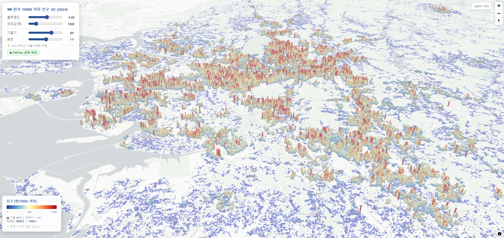

# 전국 100M 격자 인구(2024) 3D 단계구분도 

전국 100m 격자 단위 인구 데이터를 3D 기둥(fill-extrusion) 방식으로 시각화하는 웹 뷰어입니다.  
**MapLibre GL JS** + **PMTiles** 기반으로 별도 서버 없이 정적 파일만으로 동작합니다.

🔗 **라이브 데모**: [thlee33.github.io/pmtiles_pop100](https://thlee33.github.io/pmtiles_pop100/)

---

---

## 데이터 출처

| 항목 | 내용 |
|---|---|
| 격자 폴리곤 | 통계지리정보서비스(SGIS) — 전국 100m 격자 경계  |
| 인구 속성 | 통계지리정보서비스(SGIS) — 100m 격자 인구 통계 (2024년 기준. 2026.04기준 최신) |
| 좌표계 원본 | EPSG:5179 (Korea 2000 / Unified CS) |
| 웹 서빙 좌표계 | EPSG:4326 (WGS84) |

- 속성: `grid_cd` (격자코드), `pop_total` (총인구), `pop_male` (남자), `pop_female` (여자)
- 인구 없는 격자는 `pop_total = -1` (NULL 처리), 뷰어에서 필터로 제외하여 투명하게 표시

---

## 시각화 방식

### 줌 레벨에 따른 심리스 데이터 전환

| 줌 레벨 | 데이터 소스 | 표시 격자 |
|---|---|---|
| < 10 (전국·광역) | `grid100m_pop1000.geojson` (로컬) | 인구 ≥ 1,000명 격자 (1,250개) |
| ≥ 10 (시·구·동 이하) | PMTiles (Cloudflare R2) | 전체 격자 |

패널 하단 배지(📦 GeoJSON / 🗂 PMTiles)로 현재 사용 중인 소스를 실시간 확인 가능합니다.

### 3D 기둥 (fill-extrusion)

- **기둥 높이**: 인구 1명 = 1m (최대값 슬라이더로 상한 조정)
- **색상 스케일**: RdYlBu 역전 (파랑 = 소, 빨강 = 다)

---

## 컨트롤

| 컨트롤 | 설명 |
|---|---|
| 불투명도 | 레이어 전체 투명도 조절 (기본 60%) |
| 최대값(명) | 색상 및 기둥 높이의 상한값 (기본 1,000명) |
| 기울기 | 지도 pitch 각도 (기본 45°) |
| 회전 | 지도 bearing 방향 (기본 0°) |
| Ctrl+드래그 | 마우스로 기울기·회전 직접 조작 |

---

## 기술 스택

| 라이브러리 | 버전 | 용도 |
|---|---|---|
| MapLibre GL JS | 4.7.1 | 웹 지도 GPU 렌더링 |
| pmtiles.js | 3.2.1 | PMTiles 프로토콜 처리 |
| CartoDB Positron | - | 배경지도 |
| Cloudflare R2 | - | PMTiles 정적 호스팅 |
| GeoPandas | - | 공간데이터 가공 |
| tippecanoe | - | FlatGeobuf → PMTiles 변환 |

---

## 라이선스

- **데이터**: 통계청 공공데이터 (출처 표기 필요)
